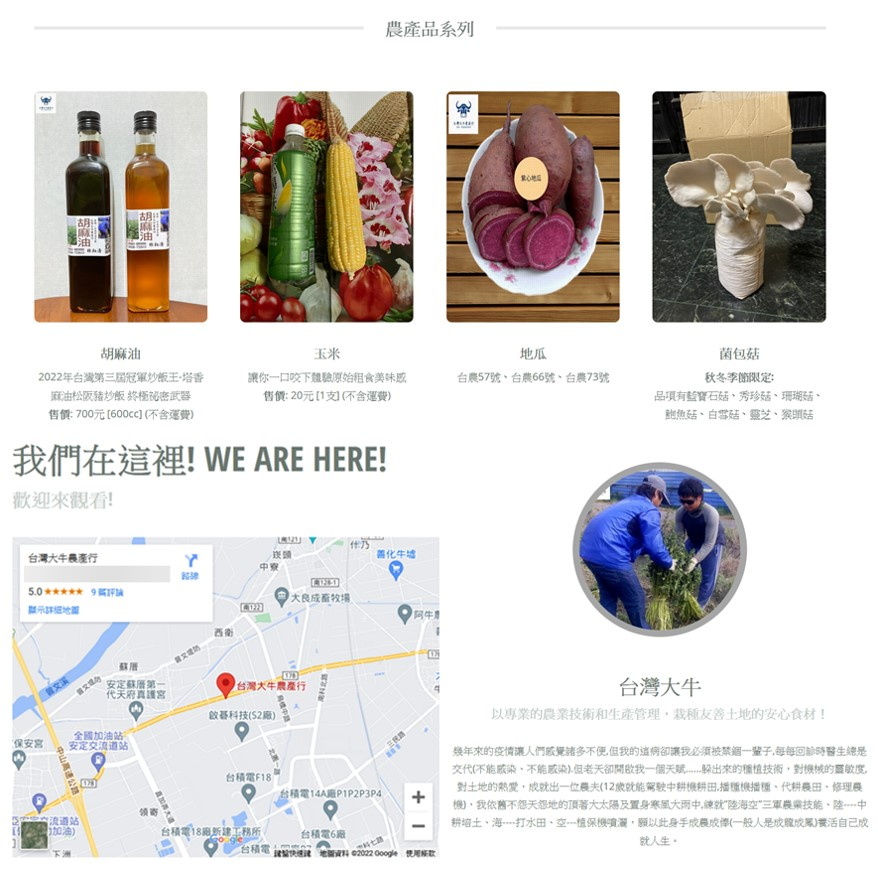

#### Client Website
###### [Taiwan Da Niou (台灣大牛)](https://taiwandaniou.netlify.app)

#### Overview
This is a paid client project that started around April 2022.
The client is a local organic farmer in Taiwan that wish have a webpage for general info & advertising.

#### Goals
Help the client create a landing page that can used to showcase the product on social media / advertising sites. (E.g. LINE Store, Google Maps, etc.)

#### Designs
The website is design to work as a info page for customers to understand more about what the client is doing and along with what their main selling products are. Since the client usually contact the customer via messaging app, this website serves as a useful demo site for providing customers with the necessary info (such as location, how to contact, etc.)

